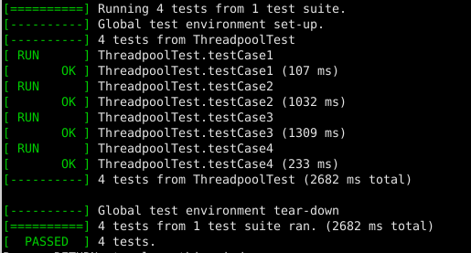

# PCO - Laboratoire 06

###### Rhyan Robertson & Dylan Canton

###### 30.05.2021

---

### Description des fonctionnalités du logiciel

Le but ici est d'implémenter un *Thread Pool*. Ce dernier permet d'allouer dynamiquement des threads lorsque cela devient nécessaire, il est ensuite aussi possible de réutiliser un thread ayant fini son exécution. Un *Thread Pool* permet donc de gérer dynamiquement des threads et donc de répartir la charge de calcul entre plusieurs cœurs et donc plusieurs threads. 

L'implémentation va s'effectuer à l'aide d'**un moniteur de Mesa** producteurs/consommateurs pour la synchronisation des threads. 

---

### Implémentation

#### Création d'un Thread pool :

Lors de la création d'une piscine, aucun thread n'est créé, seul la taille de la piscine et le nombre maximal de requêtes sont spécifiés.

Le premier thread sera créer lors du premier appel à la méthode `start(Runnable)`.


#### Gestion des requêtes dans le Thread Pool

La gestion du *Thread Pool* s'effectue dans la fonction `start(Runnable* runnable)` de la classe `ThreadPool`. Un *runnable* correspond à une requête à traiter par un thread.

Nous avons décomposé l'exécution du *Thread Pool* en 4 cas distincts afin de gérer les threads et requêtes correctement lors de l'arrivée d'une nouvelle requête : 

* Si le nombre de *runnable* qui attendent dans la file d'attente est supérieur au nombre maximum de *runnable* autorisé dans la file d'attente, le *runnable* est alors abandonné (on stoppe l'exécution du *runnable* et on retourne *false*).
* Si un thread est en attente, on met le *runnable* dans la file d'attente et on relâche directement un thread pour qu'une requête soit traitée immédiatement. 
* Si aucun thread n'est disponible et que le *Thread Pool* n'est pas déjà plein, on peut créer un nouveau thread, mettre le *runnable* dans la file d'attente et relâcher directement le thread pour qu'une requête soit traitée immédiatement. 
* Pour finir, si aucun thread n'est disponible, que le *Thread Pool* est déjà plein mais que la file d'attente de *runnable* n'est pas pleine, on bloque le caller jusqu'a qu'un thread soit disponible sinon on n'exécute pas la requête.

#### Traitement d'une requête par un thread

Le traitement d'une requête par un thread s'effectue dans une fonction `processRunnable()` qui implément un moniteur Mesa. 
Elle boucle continuellement jusqu'à la déstruction de la piscine et peut donc "attraper de multiples requêtes". À chaque boucle, elle signale la variable condition "waitForThread", ce qui permet de notifier à un **wait()** qu'un thread est en attente d'un runnable.

Une variable conditon suspend le thread (attente passive)  jusqu'à qu'une nouvelle requête arrive et signale la variable cond.

Elle déverrouille le mutex avant de lancer le runnable, pour ne pas bloquer d'autres threads.

#### Déstruction du Thread pool :

La déstruction de la piscine ce fait par étape:
```c++
/**
* @brief ~ThreadPool Destructor
*        Wakes all sleeping threads and waits for them to finish
*/
~ThreadPool(){

	stop = true;	// Étape 1

    // Signal to all waiting threads to continue
    waitForRunnable.notifyAll(); // Étape 2

    // Étape 3
    // Wait for all threads to terminate
    for(auto& thread: threads){
        thread->join();
        delete thread;
    }
}
```

1. Change la valeur de la variable `stop` à true, ce qui permet de bloquer le lancement de nouvelles requêtes dans la méthode `start(Runnable)`. Et d'annuler le lancement de runnable en attente
2. Signaler à tous les thread en attente de se réveiller. Ils pourront ainsi continue leur exécution et s'arrêter grace à la variable `stop` changée précédament.
3. Attendre que tout les threads se termine.

---

### Tests

Les tests ont été effectués à l'aide du fichier `tst_threadpool.cpp`, 4 tests ont été effectués permettant de tester le lancement, la gestion et la terminaison de plusieurs tailles de *Thread Pool*.

La capture ci-dessous montre le résultat des tests. 




---

### Remarques

Nous avons observé des divergences dans les résultats de tests, ces derniers se basant sur un temps exécution afin de valider ou non le test. Même si dans la majorité des cas, les tests passent, il arrive parfois qu'une partie des tests échoue en raison de ce temps exécution (erreur de quelques "ms"). Malgré cela, le comportement du programme est fonctionnel. 
